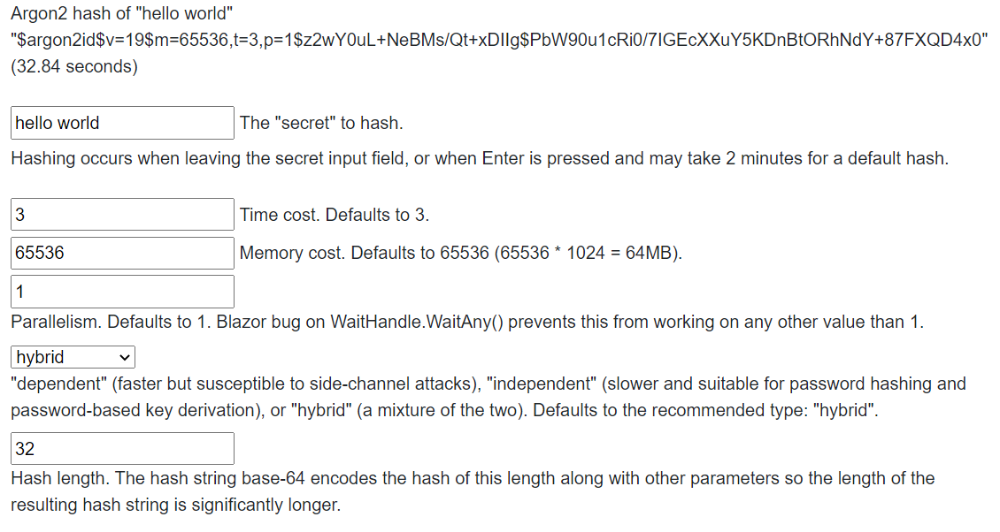

# Argon2 with Blazor WebAssembly

The managed Argon2 implementation can run in a Blazor WebAssembly application without
a native Argon2 library. Browser performance varies substantially by runtime, browser,
device, build mode, and Argon2 parameters, so publish the application and benchmark the
actual devices you intend to support.

Browser WebAssembly cannot provide the operating-system memory locking used by
`SecureArray` on desktop and server platforms. Sensitive buffers are still pinned while
in use and zeroed on disposal. See [Secure memory by platform](secure-memory.md) and
[Native AOT and browser WebAssembly](aot-and-wasm.md).

## Example

The sample component disables its input while hashing so that the user cannot start
overlapping operations:

> 

The essential call remains the same as on other platforms:

```csharp
string encodedHash = await Task.Run(() => Argon2.Hash(password));
bool valid = Argon2.Verify(encodedHash, password);
```

Avoid assuming that `Task.Run` creates a background thread in every browser runtime.
Its scheduling behavior depends on the WebAssembly runtime and whether browser threads
are enabled. Keep the UI responsive and prevent unbounded concurrent hashes regardless
of the runtime's threading support.

The complete sample is in the
[TestBlazor/Wasm project](https://github.com/mheyman/Isopoh.Cryptography.Argon2/tree/main/test/TestBlazor/Wasm).
