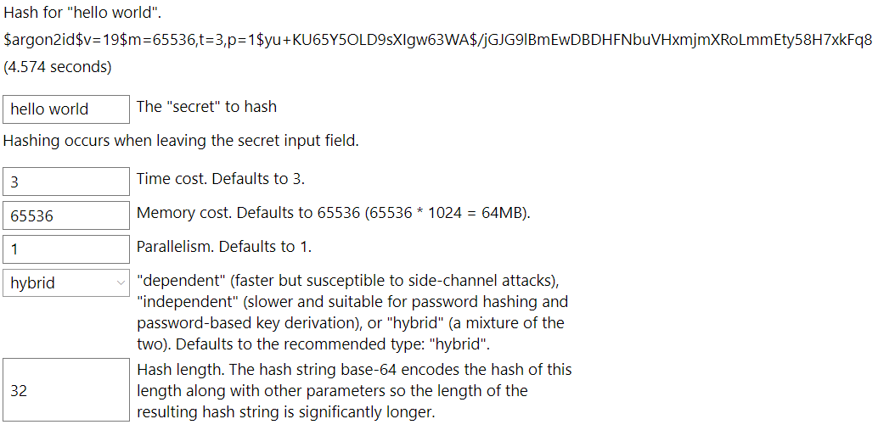

# Argon2 with Uno Platform WebAssembly

The repository includes a legacy Uno Platform WebAssembly example showing how the
managed Argon2 implementation can be called from a XAML-based application. Uno and its
WebAssembly toolchain evolve independently of this library, so treat the sample as an
integration starting point and verify it against the Uno version used by your
application.

The browser has the same security boundary as Blazor WebAssembly: `SecureArray` can pin
and zero buffers, but it cannot lock them against swapping. See
[Secure memory by platform](secure-memory.md).

## Example

> 

The XAML is available in
[MainPage.xaml](https://github.com/mheyman/Isopoh.Cryptography.Argon2/blob/main/test/TestUno/TestUno.Shared/MainPage.xaml),
and its code-behind is in
[MainPage.xaml.cs](https://github.com/mheyman/Isopoh.Cryptography.Argon2/blob/main/test/TestUno/TestUno.Shared/MainPage.xaml.cs).

The complete example is in the
[TestUno directory](https://github.com/mheyman/Isopoh.Cryptography.Argon2/tree/main/test/TestUno).
